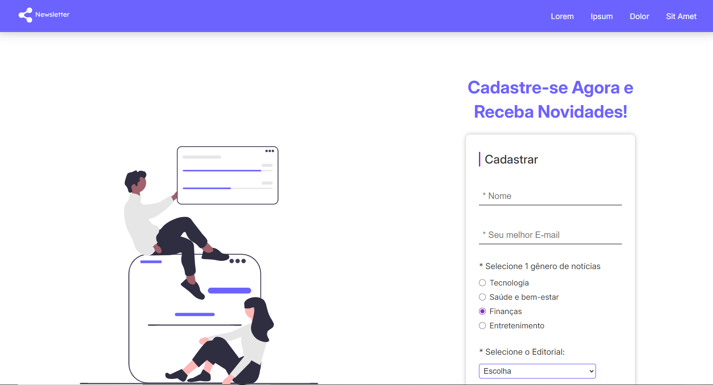

# 📰 Newsletter - Página de formulário interativa e responsiva
## Link do Site: https://brenodev00.github.io/Newsletter/

## Descrição
- Página web com campos de formulário interativos e validados com Javascript no lado cliente. Também foi desenvolvido um modal de feedback que simula o envio de formulário se todos os campos forem preenchidos corretamente.
## Tecnologias utilizadas 
- HTML5: estruturação dos elementos da página web;
- CSS3: estilização dos elementos da página web;
- Javascript: Manipulação do DOM para interatividade de elementos e validações de formulário personalizadas.
- GitHub Pages: utilizado para hospedar o site.
## Licença
Este código está licenciado usando a [licença-MIT](./LICENSE).
 
